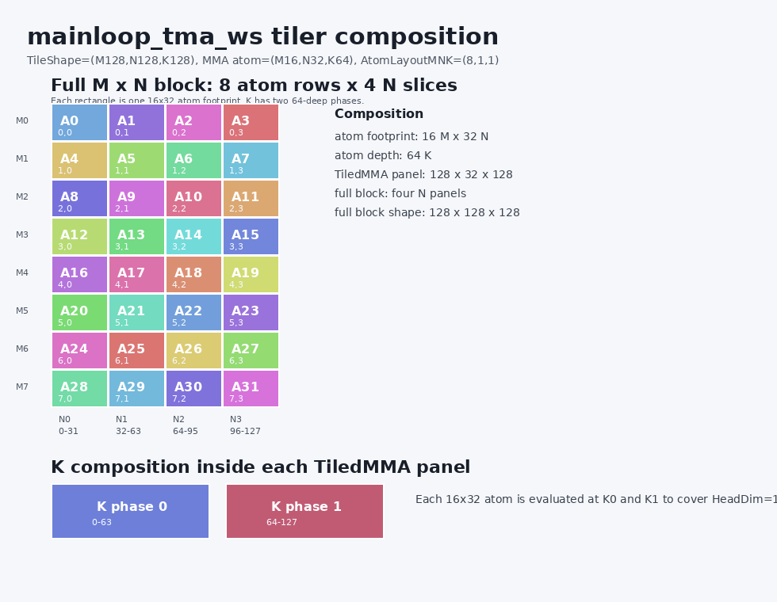
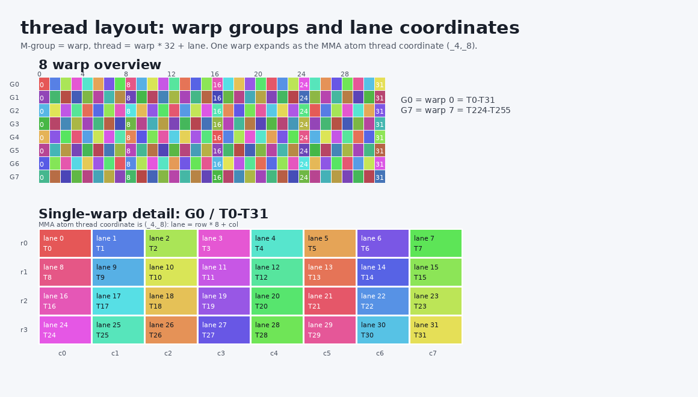
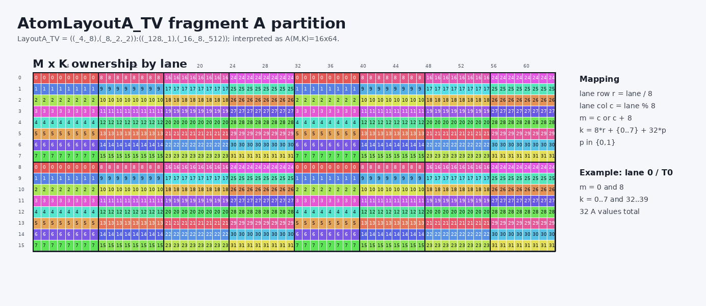
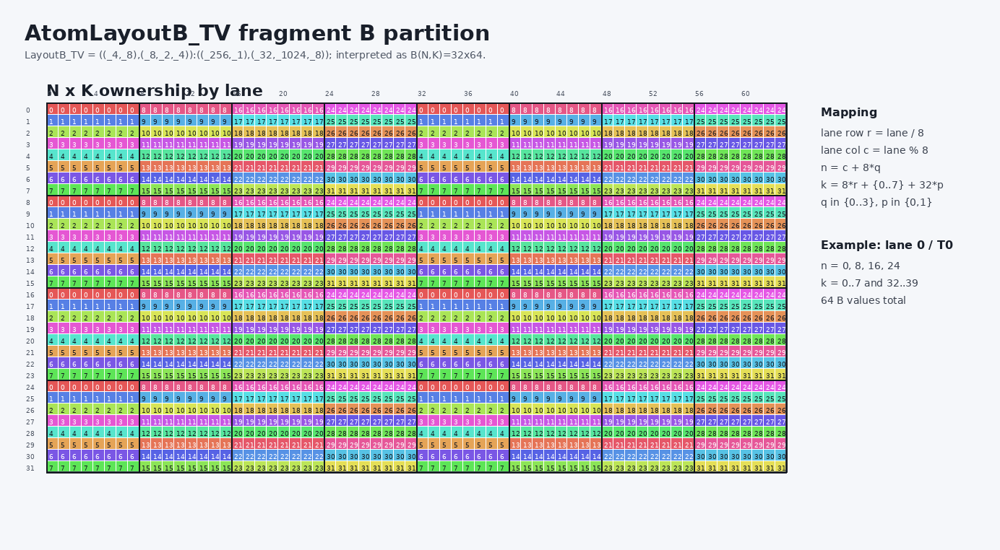
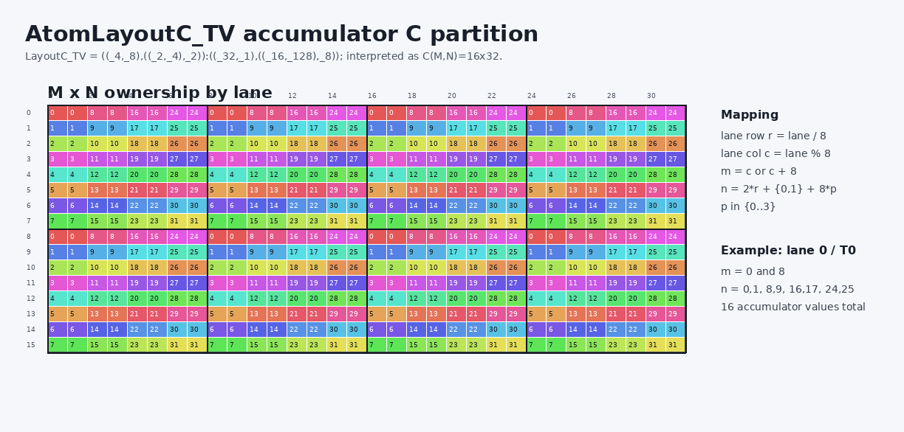
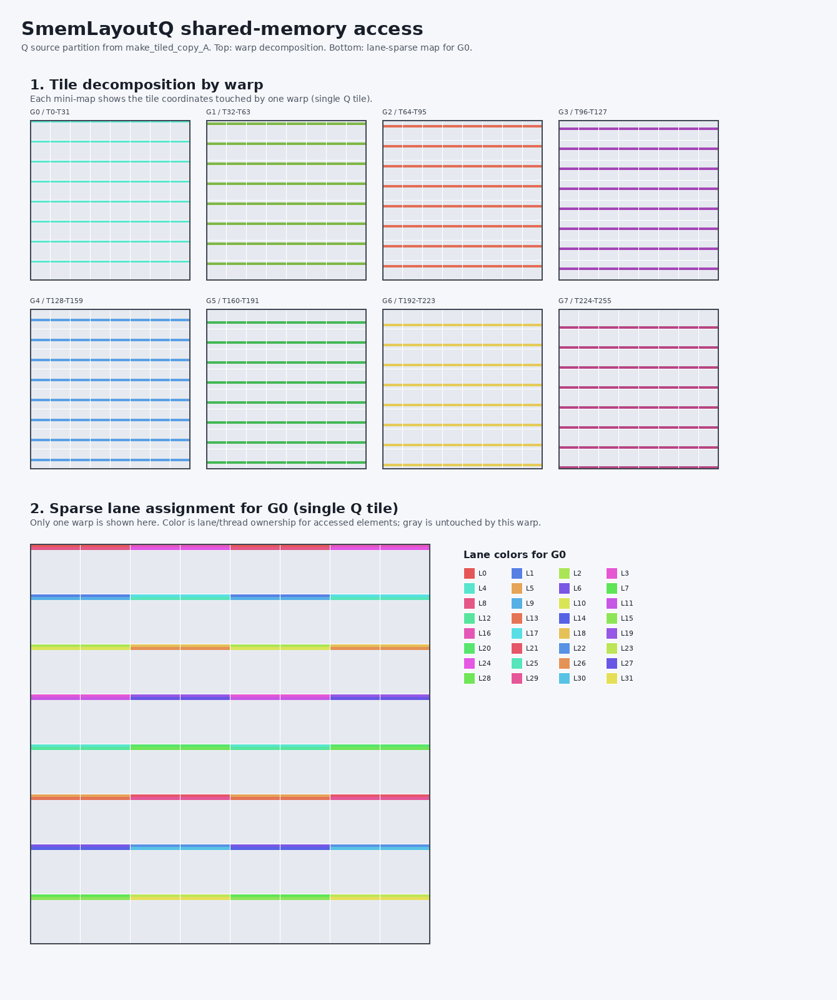
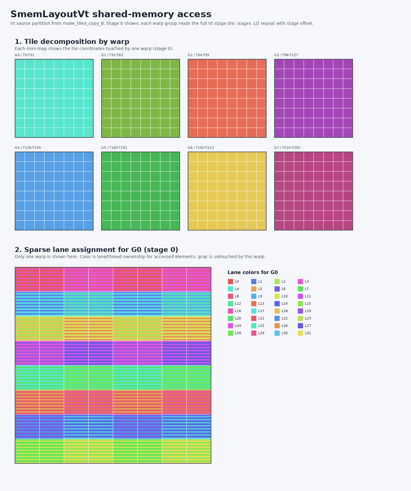

# SageAttention4 Blackwell Debug Notes

This folder contains the Blackwell CUDA path for SageAttention4. The local CMake
file includes a standalone debug target named `mainloop_tma_ws_debug` that
instantiates `mainloop_tma_ws.h` and prints the main compile-time shapes and
layouts used by the TMA mainloop.

The target is marked `EXCLUDE_FROM_ALL`, so IDEs can index and build it without
making it part of the default extension build.

## Build

From the repository workspace used by the tests:

```bash
cmake -S ../sageattn4/blackwell -B /tmp/sageattn4_blackwell_cmake_debug
cmake --build /tmp/sageattn4_blackwell_cmake_debug --target mainloop_tma_ws_debug
/tmp/sageattn4_blackwell_cmake_debug/mainloop_tma_ws_debug
```

The CMake configure path pins Python to `/venv/main/bin/python`, so IDE-driven
CMake configure runs use the same Python environment even when they do not pass
extra CMake arguments.

## Useful Knobs

The default instantiation is `HeadDim=128`, `BlockM=128`, `BlockN=128`,
`Stages=3`, `ClusterM=1`, `BlockMean=1`, and non-causal. Override any of these
at configure time:

```bash
cmake -S ../sageattn4/blackwell -B /tmp/sageattn4_blackwell_cmake_debug \
  -DSAGEATTN4_DEBUG_HEADDIM=128 \
  -DSAGEATTN4_DEBUG_BLOCK_M=128 \
  -DSAGEATTN4_DEBUG_BLOCK_N=128 \
  -DSAGEATTN4_DEBUG_STAGES=3 \
  -DSAGEATTN4_DEBUG_CLUSTER_M=1 \
  -DSAGEATTN4_DEBUG_BLOCK_MEAN=1 \
  -DSAGEATTN4_DEBUG_IS_CAUSAL=0 \
  -DSAGEATTN4_DEBUG_THREAD_IDX=0
```

## Default Run Summary

The captured default run reports:

- `kHeadDim=128`, `kBlockM=128`, `kBlockN=128`, `kStages=3`
- `kNWarps=12`, `kNThreads=384`
- QK and PV MMA atom: `SM120_16x32x64_TN_VS_NVFP4`
- Tile shape: `(_128,_128,_128)`
- QK and PV tiled MMA shape: `(_128,_32,_128)`
- Shared storage: `100352` bytes, aligned to `1024`
- TMA transaction bytes: `Q=9216`, `K=9728`, `V=9216`

## Layout Visualizations

The generated PNGs are split by layout so each view can be inspected directly:

- Tiler composition: how the `16x32x64` MMA atom is logically composed into
  the `128x32x128` tiled MMA panel, then into the full `128x128x128` block.
- Thread layout: expands one warp as the MMA atom thread coordinate `(_4,_8)`
  so lane assignment is visible without relying on color alone.
- Fragment layouts: `AtomLayoutA_TV`, `AtomLayoutB_TV`, and `AtomLayoutC_TV`
  are rendered as lane-ownership maps over their logical A/B/C tiles.
- Shared-memory access maps: exact CuTe identity-tensor coordinates for the
  source smem partitions used by `make_tiled_copy_A/B`. Each PNG first shows
  the tile decomposition by warp group, then a single-warp color matrix showing
  sparse lane ownership for the elements accessed by `G0`. The copy-layout
  tensor views are intentionally omitted.

In the shared maps, the top section uses one color per warp group. The bottom
section shows only `G0`, with one color per lane/thread and gray for tile
coordinates untouched by that warp. `SmemLayoutQ` shows the single `128x128`
Q tile. `SmemLayoutK` and `SmemLayoutVt` show stage 0; stages 1/2 repeat with
the stage offset, and each warp group rereads the full stage tile.

Regenerate the checked-in PNGs after rebuilding `mainloop_tma_ws_debug` with:

```bash
python3 generate_layout_visualizations.py --debug-bin /tmp/sageattn4_blackwell_cmake_debug/mainloop_tma_ws_debug
```
















## Captured Default Log

```text
SageAttention4 mainloop_tma_ws debug
Config
  kHeadDim: 128
  kBlockM: 128
  kBlockN: 128
  kStages: 3
  EpiStages: 1
  kNWarps: 12
  kNThreads: 384
  kClusterM: 1
  BlockMean: 1
  IsCausal: 0
  Debug consumer thread_idx: 0

Types
  Element: cutlass::float_e2m1_t
  ElementSF: cutlass::float_ue4m3_t
  ElementOut: cutlass::bfloat16_t
  ElementQMma: cutlass::detail::float_e2m1_unpacksmem_t
  ElementKMma: cutlass::detail::float_e2m1_unpacksmem_t
  TiledMmaQK::Atom: cute::MMA_Atom<cute::SM120::BLOCKSCALED::SM120_16x32x64_TN_VS_NVFP4>
  TiledMmaPV::Atom: cute::MMA_Atom<cute::SM120::BLOCKSCALED::SM120_16x32x64_TN_VS_NVFP4>

Core shapes
  TileShape_MNK                    (_128,_128,_128)
  ClusterShape_MNK                 (_1,_1,_1)
  AtomLayoutMNK                    (_8,_1,_1):(_1,_0,_0)
  PermTileM                        _128
  PermTileN                        _32
  PermTileK                        _128
  NumSFQK: 8
  NumSFPV: 8
  MMA_NSF: 4

MMA QK
  TiledMmaQK                       TiledMMA
  ThrLayoutVMNK:  (_32,_8,_1,_1):(_1,_32,_0,_0)
  PermutationMNK: (_128,_32,_128)
MMA_Atom
  ThrID:      _32:_1
  Shape_MNK:  (_16,_32,_64)
  LayoutA_TV: ((_4,_8),(_8,_2,_2)):((_128,_1),(_16,_8,_512))
  LayoutB_TV: ((_4,_8),(_8,_2,_4)):((_256,_1),(_32,_1024,_8))
  LayoutC_TV: ((_4,_8),((_2,_4),_2)):((_32,_1),((_16,_128),_8))

  tile_shape(QK)                   (_128,_32,_128)
  AtomShape_MNK(QK)                (_16,_32,_64)
  AtomLayoutA_TV(QK)               ((_4,_8),(_8,_2,_2)):((_128,_1),(_16,_8,_512))
  AtomLayoutB_TV(QK)               ((_4,_8),(_8,_2,_4)):((_256,_1),(_32,_1024,_8))
  AtomLayoutC_TV(QK)               ((_4,_8),((_2,_4),_2)):((_32,_1),((_16,_128),_8))
  thr_layout_vmnk(QK)              (_32,_8,_1,_1):(_1,_32,_0,_0)
  layoutSFA_TV(QK)                 ((_2,_2,_8,_8),(_64,(_1,_2))):((_8,_0,_1,_16),(_128,(_0,_8192)))
  layoutSFB_TV(QK)                 ((_4,_8,_8),(_64,(_1,_2))):((_8,_1,_0),(_32,(_0,_2048)))

MMA PV
  TiledMmaPV                       TiledMMA
  ThrLayoutVMNK:  (_32,_8,_1,_1):(_1,_32,_0,_0)
  PermutationMNK: (_128,_32,_128)
MMA_Atom
  ThrID:      _32:_1
  Shape_MNK:  (_16,_32,_64)
  LayoutA_TV: ((_4,_8),(_8,_2,_2)):((_128,_1),(_16,_8,_512))
  LayoutB_TV: ((_4,_8),(_8,_2,_4)):((_256,_1),(_32,_1024,_8))
  LayoutC_TV: ((_4,_8),((_2,_4),_2)):((_32,_1),((_16,_128),_8))

  tile_shape(PV)                   (_128,_32,_128)
  AtomShape_MNK(PV)                (_16,_32,_64)
  thr_layout_vmnk(PV)              (_32,_8,_1,_1):(_1,_32,_0,_0)
  layoutSFB_TV(PV)                 ((_4,_8,_8),(_64,(_1,_2))):((_8,_1,_0),(_32,(_0,_2048)))

Shared memory storage
  SharedStorage bytes: 100352
  SharedStorage align: 1024
  smem_q elements: 16384
  smem_k elements: 49152
  smem_v elements: 49152
  smem_ds elements: 384
  smem_o elements: 16384
  smem_SFQ elements: 1024
  smem_SFK elements: 3072
  smem_SFVt elements: 3072

SmemLayoutQ
  layout                           Sw<2,4,3> o smem_ptr[4b](unset) o ((_8,_16),(_128,_1)):((_128,_1024),(_1,_0))
  shape                            ((_8,_16),(_128,_1))
  size                             _16384
  cosize                           _16384
SmemLayoutK
  layout                           Sw<2,4,3> o smem_ptr[4b](unset) o ((_8,_16),(_128,_1),(_1,_3)):((_128,_1024),(_1,_0),(_0,_16384))
  shape                            ((_8,_16),(_128,_1),(_1,_3))
  size                             _49152
  cosize                           _49152
SmemLayoutV
  layout                           Sw<2,4,3> o smem_ptr[4b](unset) o ((_8,_16),(_128,_1),(_1,_3)):((_128,_1024),(_1,_0),(_0,_16384))
  shape                            ((_8,_16),(_128,_1),(_1,_3))
  size                             _49152
  cosize                           _49152
SmemLayoutVt
  layout                           Sw<2,4,3> o smem_ptr[4b](unset) o ((_8,_16),(_128,_1),(_1,_3)):((_128,_1024),(_1,_0),(_0,_16384))
  shape                            ((_8,_16),(_128,_1),(_1,_3))
  size                             _49152
  cosize                           _49152
SmemLayoutDS
  layout                           ((_128,_1),(_128,_1),(_1,_3)):((_0,_0),(_1,_0),(_0,_128))
  shape                            ((_128,_1),(_128,_1),(_1,_3))
  size                             _49152
  cosize                           _384
SmemLayoutO
  layout                           Sw<3,4,3> o smem_ptr[16b](unset) o ((_8,_16),(_64,_2)):((_64,_512),(_1,_8192))
  shape                            ((_8,_16),(_64,_2))
  size                             _16384
  cosize                           _16384
SmemLayoutSFQ
  layout                           (((_16,_4),_2),((_16,_4),_1,_2)):(((_16,_4),_256),((_0,_1),_4,_512))
  shape                            (((_16,_4),_2),((_16,_4),_1,_2))
  size                             _16384
  cosize                           _1024
SmemLayoutSFK
  layout                           (((_16,_4),_2),((_16,_4),_1,_2),_3):(((_16,_4),_256),((_0,_1),_4,_512),_1024)
  shape                            (((_16,_4),_2),((_16,_4),_1,_2),_3)
  size                             _49152
  cosize                           _3072
SmemLayoutSFV
  layout                           (((_16,_4),_2),((_16,_4),_1,_2),_3):(((_16,_4),_256),((_0,_1),_4,_512),_1024)
  shape                            (((_16,_4),_2),((_16,_4),_1,_2),_3)
  size                             _49152
  cosize                           _3072
SmemLayoutSFVt
  layout                           (((_16,_4),_2),((_16,_4),_1,_2),_3):(((_16,_4),_256),((_0,_1),_4,_512),_1024)
  shape                            (((_16,_4),_2),((_16,_4),_1,_2),_3)
  size                             _49152
  cosize                           _3072
LayoutP
  layout                           ((_8,_2,_2),_1,_2):((_1,_8,_16),_0,_32)
  shape                            ((_8,_2,_2),_1,_2)
  size                             _64
  cosize                           _64
LayoutSFP
  layout                           ((_16,_4),_1,_2):((_0,_1),_0,_4)
  shape                            ((_16,_4),_1,_2)
  size                             _128
  cosize                           _8

TMA transaction bytes
  Q: 9216
  K: 9728
  V: 9216

Mainloop consumer fragments
sQ
  layout                           ((_8,_16),(_128,_1)):((_128,_1024),(_1,_0))
  shape                            ((_8,_16),(_128,_1))
  size                             _16384
sK
  layout                           ((_8,_16),(_128,_1),(_1,_3)):((_128,_1024),(_1,_0),(_0,_16384))
  shape                            ((_8,_16),(_128,_1),(_1,_3))
  size                             _49152
sVt
  layout                           ((_8,_16),(_128,_1),(_1,_3)):((_128,_1024),(_1,_0),(_0,_16384))
  shape                            ((_8,_16),(_128,_1),(_1,_3))
  size                             _49152
sDS
  layout                           ((_128,_1),(_128,_1),(_1,_3)):((_0,_0),(_1,_0),(_0,_128))
  shape                            ((_128,_1),(_128,_1),(_1,_3))
  size                             _49152
sSFQ
  layout                           (((_16,_4),_2),((_16,_4),_1,_2)):(((_16,_4),_256),((_0,_1),_4,_512))
  shape                            (((_16,_4),_2),((_16,_4),_1,_2))
  size                             _16384
sSFK
  layout                           (((_16,_4),_2),((_16,_4),_1,_2),_3):(((_16,_4),_256),((_0,_1),_4,_512),_1024)
  shape                            (((_16,_4),_2),((_16,_4),_1,_2),_3)
  size                             _49152
sSFVt
  layout                           (((_16,_4),_2),((_16,_4),_1,_2),_3):(((_16,_4),_256),((_0,_1),_4,_512),_1024)
  shape                            (((_16,_4),_2),((_16,_4),_1,_2),_3)
  size                             _49152
tSrQ
  layout                           ((_8,_2,_2),_1,_2):((_1,_8,_16),_0,_32)
  shape                            ((_8,_2,_2),_1,_2)
  size                             _64
tSrK
  layout                           ((_8,_2,_4),_4,_2):((_1,_8,_16),_128,_64)
  shape                            ((_8,_2,_4),_4,_2)
  size                             _512
tOrVt
  layout                           ((_8,_2,_4),_4,_2):((_1,_8,_16),_128,_64)
  shape                            ((_8,_2,_4),_4,_2)
  size                             _512
tSrS
  layout                           (((_2,_4),_2),_1,_4):(((_1,_2),_8),_0,_16)
  shape                            (((_2,_4),_2),_1,_4)
  size                             _64
tSrSConversion
  layout                           (((_2,_4),(_2,(_2))),_1,(_2)):(((_1,_2),(_8,(_16))),_0,(_32))
  shape                            (((_2,_4),(_2,(_2))),_1,(_2))
  size                             _64
AbsMaxP
  layout                           (_2,(_2,_1,_2)):(_1,(_2,_0,_4))
  shape                            (_2,(_2,_1,_2))
  size                             _8
tOrO
  layout                           (((_2,_4),_2),_1,_4):(((_1,_2),_8),_0,_16)
  shape                            (((_2,_4),_2),_1,_4)
  size                             _64
tSrSFQ
  layout                           ((_16,_4),_1,_2):((_0,_1),_0,_4)
  shape                            ((_16,_4),_1,_2)
  size                             _128
tSrSFK
  layout                           ((_16,_4),(_2,_2),_2):((_0,_1),(_4,_8),_16)
  shape                            ((_16,_4),(_2,_2),_2)
  size                             _512
tOrSFVt
  layout                           ((_16,_4),(_2,_2),_2):((_0,_1),(_4,_8),_16)
  shape                            ((_16,_4),(_2,_2),_2)
  size                             _512
tOrP
  layout                           ((_8,_2,_2),_1,_2):((_1,_8,_16),_0,_32)
  shape                            ((_8,_2,_2),_1,_2)
  size                             _64
tOrSFP
  layout                           ((_16,_4),_1,_2):((_0,_1),_0,_4)
  shape                            ((_16,_4),_1,_2)
  size                             _128
tSrDS
  layout                           (_8,_4):(_1,_8)
  shape                            (_8,_4)
  size                             _32

Mainloop smem copy views
  smem_tiled_copy_Q                TiledCopy
  Tiler_MN:       (_128,_128)
  TiledLayout_TV: ((_4,_8,_8),((_8,_2,_2),(_1,_2))):((_1024,_1,_16),((_128,_8,_4096),(_0,_8192)))
Copy_Atom
  ThrID:        _32:_1
  ValLayoutSrc: (_32,_32):(_32,_1)
  ValLayoutDst: (_32,(_8,_4)):(_8,(_1,_256))
  ValLayoutRef: (_32,(_8,_4)):(_8,(_1,_256))
  ValueType:    4b

tSsQ
  layout                           ((_32,_2),_1,_1):((_1,64),_0,_0)
  shape                            ((_32,_2),_1,_1)
  size                             _64
tSrQCopyView
  layout                           ((_32,_2),_1,_1):((_1,_32),_0,_0)
  shape                            ((_32,_2),_1,_1)
  size                             _64
  smem_tiled_copy_K                TiledCopy
  Tiler_MN:       (_32,_128)
  TiledLayout_TV: ((_4,_8,_8),((_8,_2,_4),(_1,_2))):((_256,_1,_0),((_32,_1024,_8),(_0,_2048)))
Copy_Atom
  ThrID:        _32:_1
  ValLayoutSrc: (_32,_32):(_32,_1)
  ValLayoutDst: (_32,(_8,_4)):(_8,(_1,_256))
  ValLayoutRef: (_32,(_8,_4)):(_8,(_1,_256))
  ValueType:    4b

tSsK
  layout                           ((_32,(_2,_2)),_4,_1,(_1,_3)):((_1,(_2048,64)),_4096,_0,(_0,_16384))
  shape                            ((_32,(_2,_2)),_4,_1,(_1,_3))
  size                             _1536
tSrKCopyView
  layout                           ((_32,_4),_4,_1):((_1,_32),_128,_0)
  shape                            ((_32,_4),_4,_1)
  size                             _512
  smem_tiled_copy_V                TiledCopy
  Tiler_MN:       (_32,_128)
  TiledLayout_TV: ((_4,_8,_8),((_8,_2,_4),(_1,_2))):((_256,_1,_0),((_32,_1024,_8),(_0,_2048)))
Copy_Atom
  ThrID:        _32:_1
  ValLayoutSrc: (_32,_32):(_32,_1)
  ValLayoutDst: (_32,(_8,_4)):(_8,(_1,_256))
  ValLayoutRef: (_32,(_8,_4)):(_8,(_1,_256))
  ValueType:    4b

tOsVt
  layout                           ((_32,(_2,_2)),_4,_1,(_1,_3)):((_1,(_2048,64)),_4096,_0,(_0,_16384))
  shape                            ((_32,(_2,_2)),_4,_1,(_1,_3))
  size                             _1536
tOrVtCopyView
  layout                           ((_32,_4),_4,_1):((_1,_32),_128,_0)
  shape                            ((_32,_4),_4,_1)
  size                             _512
```
